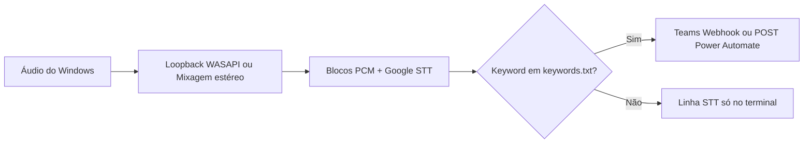

# Local Audio Keyword Monitor for Microsoft Teams (experimental)

Monitor experimental que **escuta o áudio do sistema** (reuniões Teams, browser, etc.), transcreve com **Google Speech-to-Text** e dispara **alertas** quando aparecem **palavras-chave** definidas por ti — com envio para **Microsoft Teams** via **Incoming Webhook** ou **Microsoft Power Automate** (HTTP).

> **Não é** a API oficial de transcrições do Teams. É uma alternativa quando não há **consentimento de administrador** no Entra ID para a Microsoft Graph, ou para protótipos rápidos.

---

## Índice

- [O que este repositório faz](#o-que-este-repositório-faz)
- [Três formas de usar](#três-formas-de-usar)
- [Requisitos](#requisitos)
- [Instalação rápida (modo áudio experimental)](#instalação-rápida-modo-áudio-experimental)
- [Configuração (`.env`)](#configuração-env)
- [Headset USB e loopback WASAPI](#headset-usb-e-loopback-wasapi)
- [Notificações no Teams](#notificações-no-teams)
- [Ficheiros importantes](#ficheiros-importantes)
- [Resolução de problemas](#resolução-de-problemas)
- [Privacidade e uso aceitável](#privacidade-e-uso-aceitável)

---

## O que este repositório faz

| Objetivo | Descrição |
|----------|-----------|
| **Deteção** | Comparar o texto reconhecido com palavras em `keywords.txt` (ex.: `chamada`, `arthur`). |
| **Entrada de áudio** | Captura do que **toca no PC** (loopback), não do microfone como substituto de transcrição oficial. |
| **Saída** | Mensagem no canal do Teams (webhook) ou corpo JSON para um fluxo Power Automate que publica no Teams. |

Fluxo simplificado:



---

## Três formas de usar

| Script | Quando usar |
|--------|-------------|
| **`run_alerts.py`** | Tens app no Azure, **consentimento admin**, política Teams — lê transcrições via **Graph API**. |
| **`run_local.py`** | Tens ficheiro `.vtt` / `.txt` exportado manualmente — analisa offline. |
| **`experimental_listen_loopback.py`** | Queres ouvir **ao vivo** o som do PC **sem Graph** — este README foca-se neste modo. |

Documentação extra sobre Graph e ficheiros locais: ver [`LEIAME.txt`](LEIAME.txt).

---

## Requisitos

- **Windows 10/11** (testado com captura loopback / PyAudioWPatch).
- **Python 3.10+** (recomendado 3.12).
- Conta Microsoft / Teams conforme o destino das notificações.
- Para o modo experimental: **rede** (Speech Recognition usa o serviço Google para `recognize_google`).

---

## Instalação rápida (modo áudio experimental)

```powershell
cd caminho\para\este\repositório
python -m pip install -r requirements-experimental.txt
copy .env.example .env
# Edite .env (veja secção seguinte)
python experimental_listen_loopback.py
```

**Listar dispositivos de entrada** (para índices da Mixagem ou `[Loopback]`):

```powershell
$env:LIST_AUDIO_DEVICES = "1"
python experimental_listen_loopback.py
```

---

## Configuração (`.env`)

1. Copia `.env.example` para `.env`.
2. **Nunca** faças commit do `.env` (já está no `.gitignore`).

| Variável | Descrição |
|----------|-----------|
| `LOOPBACK_MODE=wasapi` | **Recomendado para headset USB** (ex. Razer): usa **PyAudioWPatch** e a entrada `… [Loopback]` da saída predefinida. |
| `TEAMS_POWER_AUTOMATE_HTTP_URL` | URL **completo** do gatilho HTTP (tem de incluir `sig=` na query). Tem **prioridade** sobre o webhook. |
| `TEAMS_INCOMING_WEBHOOK_URL` | Webhook clássico do canal Teams (se não usares Power Automate). |
| `DRY_RUN` | Se definido como `1`, só imprime alertas no terminal — **não** envia Teams/PA. |
| `KEYWORD_COOLDOWN_SEC` | `0` = alerta sempre que a keyword aparecer no texto; valor maior evita repetições seguidas. |
| `STT_LANGUAGE` | Ex.: `pt-BR`, `en-US`. |
| `WASAPI_LOOPBACK_DEVICE_INDEX` | Opcional — força outro dispositivo `[Loopback]` (ex. Game vs Chat). |

Detalhes e mais variáveis: comentários dentro de [`.env.example`](.env.example).

---

## Headset USB e loopback WASAPI

A **Mixagem estéreo** (Realtek) muitas vezes **não mostra níveis** quando o som vai para **headset USB** — o áudio não passa pelo mesmo caminho do chip Realtek.

**Solução usada neste projeto:** `LOOPBACK_MODE=wasapi` + **PyAudioWPatch**, que expõe entradas como `Alto-falantes (Teu Headset - Chat) [Loopback]`. Assim podes **desativar a Mixagem estéreo** nas definições de som se só usares este modo.

---

## Notificações no Teams

### Opção A — Incoming Webhook

1. No **canal** do Teams: **⋯** → **Conectores** / **Workflows** → **Incoming Webhook**.
2. Copia o URL (`https://outlook.office.com/webhook/...`) para `TEAMS_INCOMING_WEBHOOK_URL`.

### Opção B — Power Automate

1. Fluxo com gatilho **“Quando uma solicitação HTTP é recebida”** e ação **“Postar mensagem em um chat ou canal”**.
2. Em **“Quem pode disparar o fluxo?”**, use **“Qualquer pessoa”** se o portal só mostrar `?api-version=1` — é preciso URL com **`sig=`** (assinatura SAS).
3. Corpo JSON esperado pelo script:

```json
{
  "keyword": "arthur",
  "excerpt": "texto transcrito…",
  "when_iso": "2026-04-07T12:00:00+00:00"
}
```

4. Na mensagem do Teams, use **conteúdo dinâmico** dos campos do gatilho — **não** escreva literalmente `[keyword]` como texto.

> Alguns tenants exigem **Power Automate Premium** para o gatilho HTTP. Se não tiveres licença, usa a **Opção A** (webhook), se a organização permitir.

---

## Ficheiros importantes

| Ficheiro | Função |
|----------|--------|
| `experimental_listen_loopback.py` | Loop principal: áudio → STT → keywords → Teams/PA. |
| `keywords.txt` | Uma palavra ou frase por linha (`#` = comentário). |
| `run_alerts.py` / `run_local.py` | Modos Graph e ficheiro local. |
| `requirements-experimental.txt` | Dependências do modo experimental. |
| `LEIAME.txt` | Instruções em português (inclui Graph e `run_local`). |

---

## Resolução de problemas

| Sintoma | O que verificar |
|---------|-----------------|
| **401** no Power Automate | URL incompleto: falta `sig=` (e muitas vezes `sp=`, `sv=`). Copie o URL **completo** após guardar o fluxo; veja secção [Notificações no Teams](#notificações-no-teams). |
| **RMS ≈ 0** / silêncio | Som não vai para a saída que o loopback capta; volume; Chat vs Game no headset; `WASAPI_LOOPBACK_DEVICE_INDEX`. |
| **PyAudio -9999** | Experimente outros índices em `AUDIO_INPUT_DEVICE_INDEX` ou use só `wasapi`. |
| **Palavras não detetadas** | Veja linhas `[STT]` no terminal; ajuste `STT_LANGUAGE` ou as palavras em `keywords.txt`. |
| **DRY_RUN ativo sem querer** | Variável de ambiente na sessão: `Remove-Item Env:DRY_RUN` no PowerShell. |

---

## Privacidade e uso aceitável

- O uso de `recognize_google` **envia trechos de áudio** para os servidores do Google.
- Gravar ou monitorizar voz de terceiros pode estar sujeito a **políticas da instituição** e à **LGPD** — use apenas onde tiveres direito e transparência.
- Não publique URLs com **`sig=`**, webhooks ou segredos em repositórios públicos.

---

## Licença e autoria

Uso educacional / protótipo. Ajuste a licença conforme a tua necessidade (ex. MIT) se quiseres distribuir o código.

---

**Repositório:** [Local-Audio-Keyword-Monitor-for-Microsoft-Teams-experimental-](https://github.com/CanaCruz/Local-Audio-Keyword-Monitor-for-Microsoft-Teams-experimental-)
